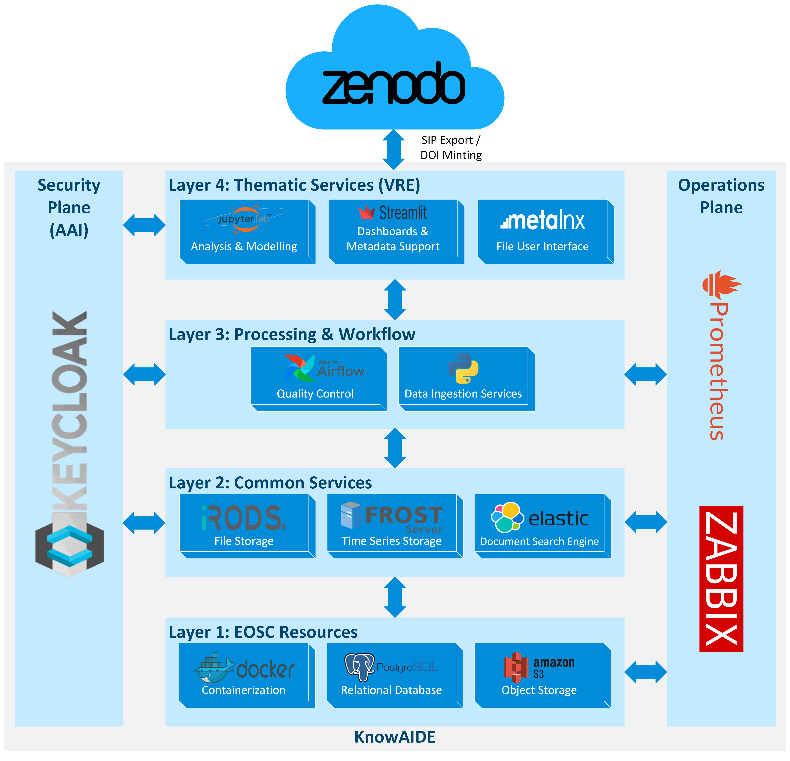

# KnowAIDE: The EDIAQI Data Platform

**KnowAIDE** (Knowledge and AI Data Environment) is a FAIR-compliant, dual-storage infrastructure designed for heterogeneous environmental health research. It serves as the central data hub for the **EDIAQI Project**, bridging the gap between high-frequency IoT sensor streams and static file-based assets.

## Key Features

⚖️ **Dual-Storage Engine**: Integrates **iRODS** for robust file management with a **FROST-Server** (OGC SensorThings API) for time-series data, capable of handling >100 million observations.

🔗 **Semantic Fusion**: Features a pre-materialized **Elasticsearch** index that links quantitative sensor readings with qualitative surveys, achieving a **14x speedup** in historical data retrieval.

🛡️ **FAIR by Design**: Automates data stewardship by minting persistent identifiers (DOIs), enforcing standardized metadata, and ensuring machine-readable licensing.

🔬 **Research-Ready**: Built-in **JupyterHub** Virtual Research Environment (VRE) for immediate Python/R analysis, model training, and visualization.

## 🏗️ Architecture

The platform follows a layered service architecture, integrating EOSC resources with domain-specific thematic services.

<p align="center">
  
  <br>
  <em>Figure: The KnowAIDE Service Architecture integrating EOSC Resources, Common Services, and Thematic Layers.</em>
</p>

## 🧩 Service Modules

The repository is organized into modular services that map to the platform's logical data lifecycle:

<table align="center">
  <tr align="center">
    <th><p align="center">📥 Ingestion & Monitoring</p></th>
    <th><p align="center">💾 Core Storage & Identity</p></th>
    <th><p align="center">🔬 Analysis & Preservation</p></th>
  </tr>
  <tr>
    <td align="left" valign="top">
      <strong><code>08_UI_csv_upload</code></strong><br>
      A user-friendly interface for ingesting raw CSV data into the FROST-Server, designed for non-technical users.<br><br>
      <strong><code>02_data_monitoring</code></strong><br>
      Real-time dashboards to monitor sensor network health and detect duplicates in incoming streams.
    </td>
    <td align="left" valign="top">
      <strong><code>03_frost_server_sync</code></strong><br>
      <strong>FROST-Server</strong> implementation of the OGC SensorThings API for managing dynamic IoT time-series data.<br><br>
      <strong><code>06_data_platform</code></strong><br>
      <strong>iRODS</strong> data grid with <strong>MetaLnx</strong> UI for policy-based file storage and metadata management.<br><br>
      <strong><code>07_keycloak</code></strong><br>
      Centralized Identity and Access Management (IAM) providing SSO across all services.<br><br>
      <strong><code>09_elasticsearch</code></strong><br>
      <strong>Elasticsearch</strong> engine hosting the Semantic Fusion Index for fast multi-modal queries.
    </td>
    <td align="left" valign="top">
      <strong><code>05_jupyterhub</code></strong><br>
      A multi-user <strong>JupyterLab</strong> environment for analysis, supporting direct interaction with both iRODS and FROST APIs, including some example notebooks.<br><br>
      <strong><code>04_frost_server_publish</code></strong><br>
      Preservation pipeline that queries observations, packages them into SIPs, and mints DOIs via Zenodo.
    </td>
  </tr>
</table>

### 📂 Directory Structure

* **`01_mainpage`**: The central landing portal providing navigation to all connected applications.
* **`10_semantic_fusion`**: Python modules for the Elasticsearch-based Semantic Fusion Layer and KnowAIDE client.

## 🚀 Quick Start

KnowAIDE utilizes Docker containerization for reproducible deployment.

**1. Prerequisites**
* Docker & Docker Compose
* Valid SSL Certificates (for production)
* A configured domain for Keycloak

**2. Deployment**
Each module contains its own `docker-compose.yaml`. To start the core identity and storage stack:

```bash
# 1. Start Identity Provider
cd 07_keycloak
docker-compose up -d

# 2. Start Storage Engines
cd 03_frost_server_sync
docker-compose up -d
cd 06_data_platform
docker-compose up -d
cd 09_elasticsearch
docker-compose up -d
```

**3. Access**
Once deployed, the main portal is accessible at: `https://your-domain.com/`

## 📚 Citation

If you use KnowAIDE in your research, please refer to the associated publication:

> *KnowAIDE: a FAIR-Compliant Data Environment to Accelerate AI Research* (2026).

***

*Developed for the [EDIAQI Project](https://ediaqi.eu) under the Horizon Europe framework.*